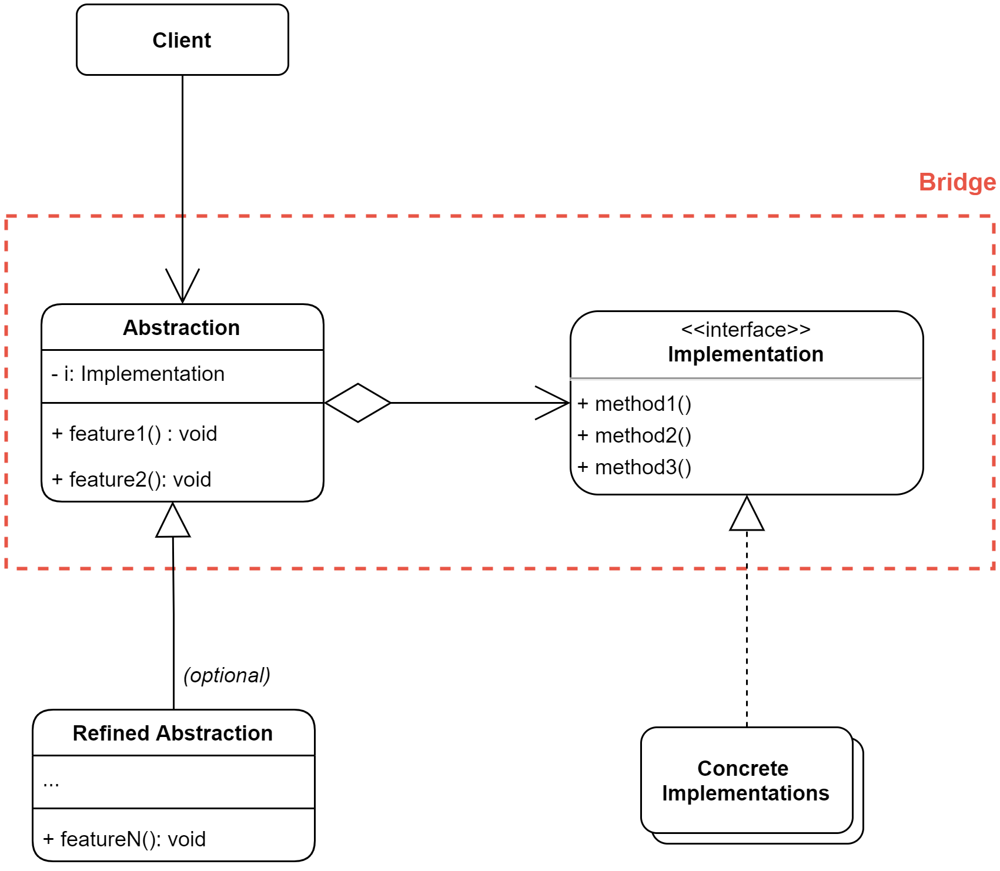

# Bridge Pattern

The **Bridge** is a structural design pattern that allows us to split a large class or a set of closely related classes into two separate hierarchies - abstraction and implementation - which can be developed independently of each other.

## The Problem

Say that we have a geometric class named `Shape` with a pair of subclasses, namely `Circle` and `Square`. We can extend this class hierarchy to incorporate colors, so we could create `Red` and `Blue` shape subclasses. However, since we already got two subclasses (`Square` and `Circle`) we need to create a total of four class combinations (`BlueSquare`, `BlueCircle`, `RedSquare`, `RedCircle`) in order to accomodate all the colors and all the objects.

Adding new shapes and colors to the hierarchy will grow this hierarchy exponentially. For example, to add a `Triangle` shape, we need to introduce two subclasses, one for each color. And after that, adding a new `Green` color, would require to create three subclasses, one for each shape. 

## The Solution

This problem occurs because we're trying to extend the shape classes in two independent dimensions: by form and by color. This is a very common issue with class inheritance.

The Bridge pattern attempts to solve this problem by switching from inheritance to the object composition. What this means is that we extrat one of the dimensions into a separate class hierarchy, so that the original classes will reference an object of the new hierarcy, instead of having all of its state and behaviours within one class.

Following this approach we can extract the color-related code into its own class with two subclasses, namely `Red` and `Blue`. The `Shape` class then gets a reference field pointing to one of the color objects. Now the shape can delegate any color-related work to the linked color object. That reference will act as a bridge between the `Shape` and `Color` classes. From now on, adding new colors won't require changing the shape hierarchy, and vice versa.

### Abstraction and Implementation

*Abstraction* (also called *interface*) is a high level control layer for some entity. This layer isn't supposed to do any real work on its own. It should delegate the work to the *implementation* layer (also called the *platform*).

Note that *interfaces* or *abstract classes* in this context have nothing to do with concepts of a programming language.

When talking about real life applications, the abstraction can be represented by a graphical user interface (GUI), and the implementation could be the underlying operating system functionality (API) which the GUI layer calls in response to user interaction.

In general, we can extend such an app in two independent directions:
- Have several different GUIs (for instance, tailored for regular customers or admins).
- Support several different APIs (for example, to be able to launch the app under Windows, Linus or MacOS).

In the worst case scenario, this app might end up looking like a giant pot of spaghetti, where hundreds of conditionals connect different types of GUI with various APIs all over the codebase.

We can bring some order to this chaos by extracting the code related to specific *interface=platform* pairs into separate classes. However, soon we'll come up with a significant problem. There are *lots* of these classes. The class hierarchy will grow exponentiallu because adding a new GUI component, or supporting a different OS API would require creating more and more classes.

Now, the Bridge pattern suggests that we will divide the classes into two hierarchies:

- **Abstraction**: The GUI layer of the application
- **Implementation**: The OS APIs.

The abstraction object controls the appearance of the app, delegating the actual work to the linked implementation object. Different implementations are interchangeable as long as tehy follow a common interface, enabling the same GUI to work under Windows and Linux.

As a result, we can change the GUI classes without touching the API-related classes. Moreover, adding support for another OS only requires creating a subclass in the implementation hierarchy.

## Structure

1. The **Abstraction** provides high-level control logic. It relies on the implementation object to do the actual low-level work.
2. The **Implementation** declares the interface that's common for all concrete implementations. An abstraction can only communicate with an implementation object via methods that are declared here. 
   
   The abstaction may list the same methods as the implementation. but usually the abstraction declares some complex behaviours that rely on a wide variety of primitive operations declared by the implementation.
3. **Concrete Implementations** contain platform-specific code.
4. **Refined Abstractions** provide variants of control logic. Like their parent, they work with different implementations via the general implementation interface.
5. Usually, the **Client** is only interested in working with the abstraction. However, it's the client's job to link the abstraction object with one of the implementation objects.

## When to Use

### Use the Bridge pattern when you want to divide and organize a monolithic class that has several variants of some functionality (for example, if the class can work with various database servers).

The bigger a class becomes, the harder it is to figure out how it works, and the longer it takes to make a change. The changes made to one of the variations of functionality may require making changes across the whole class, which often results in making errors or not addressing some critical side effects.

The Bridge pattern lets you split the monolithic class into several class hierarchies. After this, you can change the classes in each hierarchy independently of the classes in the others. This approach simplifies code maintenance and minimizes the risk of breaking existing code.

### Use the pattern when you need to extend a class in several orthogonal (independent) dimensions.

The Bridge suggests that you extract a separate class hierarchy for each of the dimensions. The original class delegates the related work to the objects belonging to those hierarchies instead of doing everything on its own.

### Use the Bridge if you need to be able to switch implementations at runtime.

Although it’s optional, the Bridge pattern lets you replace the implementation object inside the abstraction. It’s as easy as assigning a new value to a field.

## How to Implement

1. Identify the orthogonal dimensions in your classes. These independent concepts could be: abstraction/platform, domain/infrastructure, front-end/back-end, or interface/implementation.
2. See what operations the client needs and define them in the base abstraction class.
3. Determine the operations available on all platforms. Declare the ones that the abstraction needs in the general implementation interface.
4. For all platforms in your domain create concrete implementation classes, but make sure they all follow the implementation interface.
5. Inside the abstraction class, add a reference field for the implementation type. The abstraction delegates most of the work to the implementation object that’s referenced in that field.
6. If you have several variants of high-level logic, create refined abstractions for each variant by extending the base abstraction class.
7. The client code should pass an implementation object to the abstraction’s constructor to associate one with the other. After that, the client can forget about the implementation and work only with the abstraction object.

## Pros and Cons

|||
|:---|:---|
|✔️  You can create platform-independent classes and apps. |❌ You might make the code more complicated by applying the pattern to a highly cohesive class. |
|✔️ The client code works with high-level abstractions. It isn’t exposed to the platform details. ||
|✔️ *Open/Closed Principle*. You can introduce new abstractions and implementations independently from each other.||
|✔️ *Single Responsibility Principle*. You can focus on high-level logic in the abstraction and on platform details in the implementation.||

