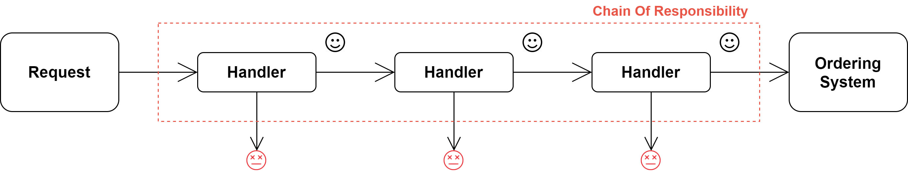
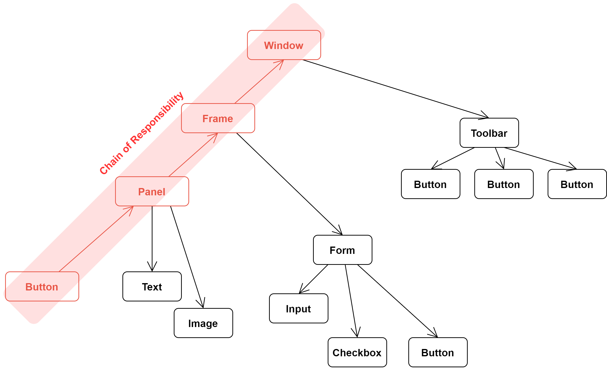
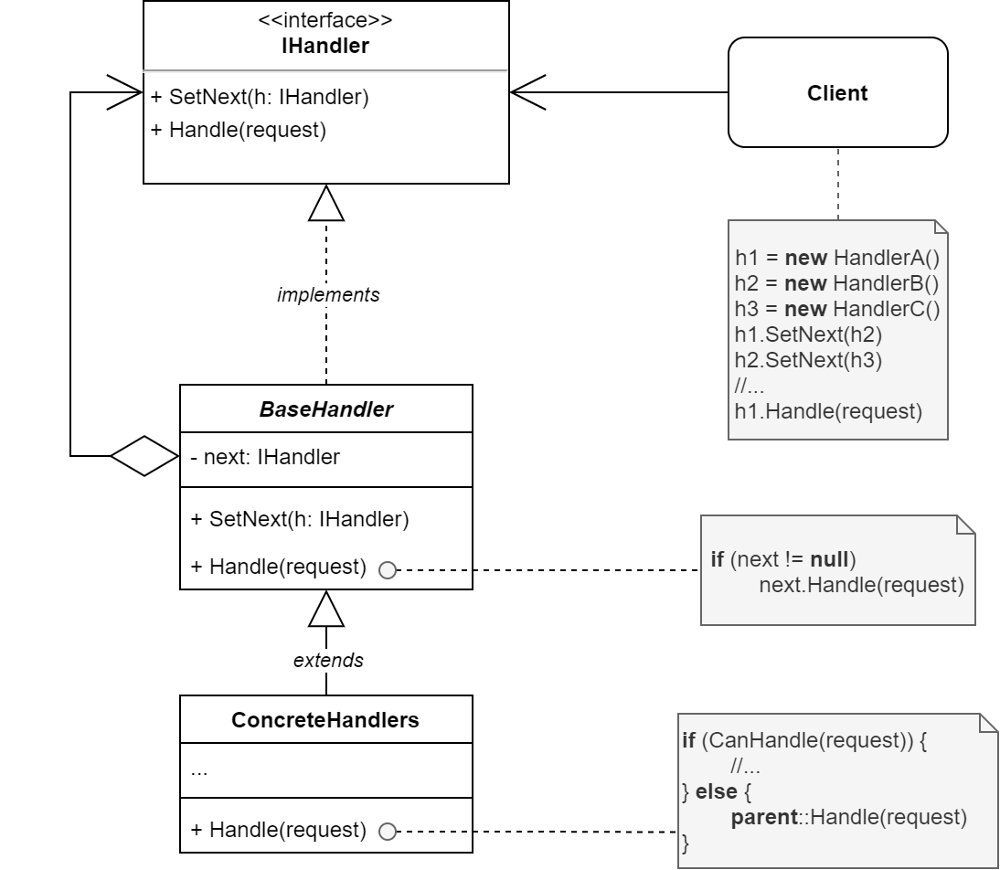

# Chain of Responsibility

The **Chain of Responsibility** is a behavioral pattern that lets you pass requests along a chain of handlers. Upon receiving a request, each handler decides either to pocess the request or to pass it to the next handler in the chain.

## The Problem

Imagine that we are working on an online ordering system. We want to restrict access to the system so that only fully authenticated users can create orders. Also, users who have elevated access must have a different set of capabilities to all orders.

After a bit of planning, we realize that all of these checks must be performed sequentially.The application can attempt to authenticate a user to the system whenever it receives a request that contains the user's credentials. However, if these credentials aren't correct and authentication fails, there's no reason to proceed with any other checks.

During the implementation of the system, several additional sequential checks appear:

- First, a security analyst pointed out that is unsafe to pass raw data straight to the ordering system. So we need to add an extra validation step to sanitize the data in the request.
- Later, somebody noticed that the system is vurnerable to brute force password cracking. To negate this, we need to add a check that filters repeated failed requests coming from the same IP address.
- Someone else suggested that we could speed up the system by returning cached results on repeated requests containing the same data. Hence, we need to add another check which lets the request pass through to the system only if there's no suitable cached response.

The code of the checks, which had already looked like a mess, became more and more bloated as we added each new feature. Changing one check sometimes affects the others. Worst of all, when we tried to reuse the checks to protect other components of the system, we had to duplicate some of the code, since those components required some of the checks, but not all of them.

The system became very hard to comprehend and expensive to maintain. We struggled with the code for a while, until one day we decided to blow the whole thing to smithereens and be done with it.

## The Solution

Like many other behavioral design patterns, the **Chain of Responsibility** relies on transforming particular behaviours into stand-alone objects, called *handlers*. In the case of our application, each check should be extracted to its own class with a single method that performs the check. The request, along with its data, is passed to this method as an argument.

The pattern suggests that you link these handlers into a chain. Each linked handler has a field for storing a reference to the next handler in the chain. In addition to processing a request, handlers pass the request further along the chain. The request travels along the chain until all handlers have had a chance to process it.

And here is the best part of the pattern: a handler can decide not to pass the request further down the chain and effectively stop any further processing.

In the example of our ordering system, a handler performs the processing and then decides whether to pass the request further down the chain. Assuming the request contains the right data, all the handlers can execute their primary behaviour, whether it's authentication checks or caching.

However, there's a slightly different approach (and it's a bit more canonical) in which, upon receiving a request, a handler decides whether it can process it. If it can, it doesn't psas the request any further. So it's either only one handler that processes the request or none at all. This approach is very common when dealing with events in stacks of elements within a graphical user interface.

For instance, when a user clicks a button, the event propagates through the chain of GUI elements that starts with the button, goes along its containers (like forms or panels), and ends up with the main application window. The event is processed by the first element in the chain that's capable of handling it. This example is also noteworthy because it shows that a chain can always be extracted from an object tree.

It's crucial that all handler classes implement the same interface. Each concrete handler should only care about the following one having the `execute` method. This way we can compose chains at runtime, using various handlers without coupling the code with their concrete classes.

## Structure

1. The **Handler** declares the interface, common for all concrete handlers. It usually contains just a single method for handling requests, but sometimes it may also have another method for setting the next handler on the chain.
2. The **Base Handler** is an optional class where you can put the boilerplate code that’s common to all handler classes.
    
    Usually, this class defines a field for storing a reference to the next handler. The clients can build a chain by passing a handler to the constructor or setter of the previous handler. The class may also implement the default handling behavior: it can pass execution to the next handler after checking for its existence.
3. **Concrete Handlers** contain the actual code for processing requests. Upon receiving a request, each handler must decide whether to process it and, additionally, whether to pass it along the chain.
    
    Handlers are usually self-contained and immutable, accepting all necessary data just once via the constructor.
4. The **Client** may compose chains just once or compose them dynamically, depending on the application’s logic. Note that a request can be sent to any handler in the chain—it doesn’t have to be the first one.

## When to Use

### Use the Chain of Responsibility pattern when your program is expected to process different kinds of requests in various ways, but the exact types of requests and their sequences are unknown beforehand.

The pattern lets you link several handlers into one chain and, upon receiving a request, “ask” each handler whether it can process it. This way all handlers get a chance to process the request.

### Use the pattern when it’s essential to execute several handlers in a particular order.

Since you can link the handlers in the chain in any order, all requests will get through the chain exactly as you planned.

### Use the CoR pattern when the set of handlers and their order are supposed to change at runtime.

If you provide setters for a reference field inside the handler classes, you’ll be able to insert, remove or reorder handlers dynamically.

## How to Implement

1. Declare the handler interface and describe the signature of a method for handling requests.
    Decide how the client will pass the request data into the method. The most flexible way is to convert the request into an object and pass it to the handling method as an argument.
2. To eliminate duplicate boilerplate code in concrete handlers, it might be worth creating an abstract base handler class, derived from the handler interface.
    This class should have a field for storing a reference to the next handler in the chain. Consider making the class immutable. However, if you plan to modify chains at runtime, you need to define a setter for altering the value of the reference field.

    You can also implement the convenient default behavior for the handling method, which is to forward the request to the next object unless there’s none left. Concrete handlers will be able to use this behavior by calling the parent method.
3. One by one create concrete handler subclasses and implement their handling methods. Each handler should make two decisions when receiving a request:

    - Whether it’ll process the request.
    - Whether it’ll pass the request along the chain.
4. The client may either assemble chains on its own or receive pre-built chains from other objects. In the latter case, you must implement some factory classes to build chains according to the configuration or environment settings.
5. The client may trigger any handler in the chain, not just the first one. The request will be passed along the chain until some handler refuses to pass it further or until it reaches the end of the chain.
6. Due to the dynamic nature of the chain, the client should be ready to handle the following scenarios:

    - The chain may consist of a single link.
    - Some requests may not reach the end of the chain.
    - Others may reach the end of the chain unhandled.

## Pros and Cons

|||
|:---|:---|
|✔️  You can control the order of request handling. |❌ Some requests may end up unhandled. |
|✔️ *Single Responsibility Principle*. You can decouple classes that invoke operations from classes that perform operations.||
|✔️ *Open/Closed Principle*. You can introduce new handlers into the app without breaking the existing client code.||

