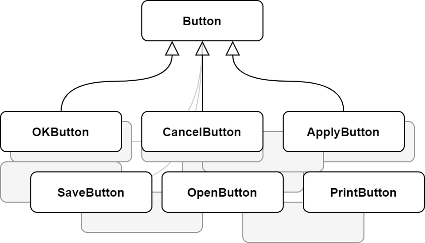
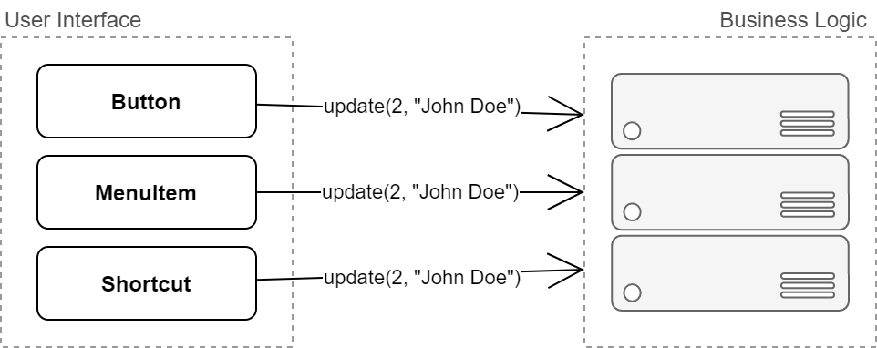
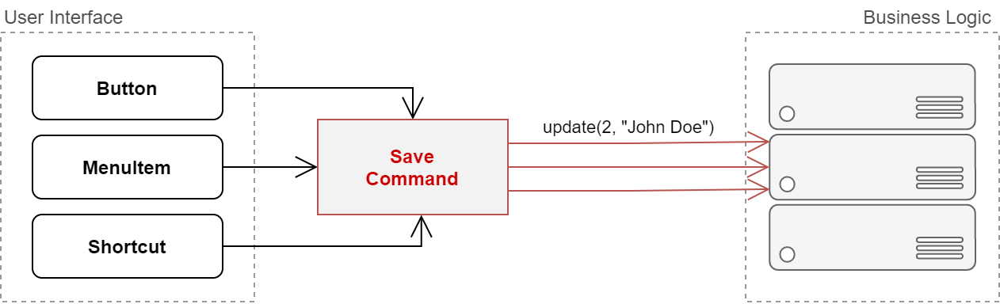
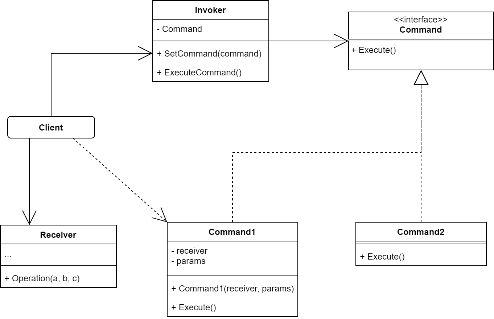

# Command Pattern

A **Command** is a behavioral design pattern that turns a request into a stand-alone object that contains all information about the request. The transformation lets us pass requests as method arguments, delay or queue a request's execution, and support undoable operations.

## The Problem

Imagine that we are working on a new text0editor app. Our current task is to create a toolbar with a bunch of buttons for various operations of the editor. We have already created a very neat `Button` class that can be used for buttons on he toolbar, as well as for generic buttons in various dialogs.

While all of these buttons look similar, they're supposed to do different things. Where should we put the code for the various click handlers of these buttons? The simplest solution is to create tons of subclasses for each place where the button is used. These subclasses would contain the code that would have to be executed on a button click.

Before long, it becomes apparent that this approach is deeply flawed. First, we have an enormous number of subclasses, and that would be okay if we weren't risking breaking the code in these subclasses each time we modify the base `Button` class. Put simply, the GUI code has become awkwardly dependent on the volatile code of the business logic. 

And here's the ugliest part. Some operations, such as copy/paste, would need to be invoked from multiple places. For example, a user could click a small "Copy" button on the toolbar, or copy something via the context menu, or just hit `Ctrl + C` on the keyboard. 

Initially, when our app only had the toolbar, it was okey to place the implementation of various operations into the button subclasses. In other words, having the code for copying text  inside the `CopyButton` subclass was fine. But then, when we implement context menus, shortcuts, and other stuff, we have to either duplicate the operation's code in many classes or make menus dependent on buttons, which is an even worse option.

## The Solution

Good software design is often based on the *principle of separation of concerns*, which usually results in breaking an app into layers. The most common example: a layer for the graphical user interface and another layer for the business logic. The GUI layer is responsible for rendering a beautiful picture on the screen, capturing any input and showing results of what the user and the *app* are doing. However, when it comes to doing something important, like calculating the trajectory of the moon or composing an annual report, the GUI layer delegates the work to the underlying layer of business logic.

In the code it might look like this: a GUI object calls a method of a business logic object, passing it some arguments. This process is usually described as one object sending another a *request*.

The Command pattern suggests that GUI objects shouldn't send these requests directly. Instead, we should extract all of the request details, such as the object being called, the name of the method and the list of arguments into a separate *command* classwith a single method that triggers this request.

Command objects serve as links between various GUI and business logic objects. From now on, the GUI object doesn't need to know what business logic object will receive the request and how it'll be processed. The GUI object just triggers the command, which handles all the details.

The next step is to make our commands implement the same interface. Usually it has just a single execution method that takes no parameters. This interface lets us use various commands with the same request sender, without coupling it to concrete classes of commands. As a bonus, now we can switch command objects linked to the sender, effectively changing the sender's behaviour at runtime.

There is a piece missing from the puzzle, which is the request parameters. A GUI object might have supplied the business-layer object with some parameters. Since the command execution method doesn't have any parameters, how would we pass the request details to the receiver? It turns out the cimmand should be either pre-configured with this data, or capable of getting it on its own.

Let's get back to our text editor. After we apply the Command pattern, we no longer need all those button subclasses to implement various click behaviours. It;s enugh to put a single field into the base `Button` class that stores a reference to a command object and make the button execute that command on a click.

We'll implement a bunch of command classes for every possible operation and link them with particular buttons, depending on the buttons' intended behaviour.

Other GUI elements, such as menus, shortcuts or entire dialogs, can be implemented in the same way. They'll be linked to a command which gets executed when a user interacts with the GUI element. As you've probably guessed by now the elements related to the same operations will be linked to the same commands, preventing any code duplication.

As a result, commands become a cnvenient middle layer that reduces coupling between the GUI and business logic layers. And that's only a fraction of the benefits that the Command pattern can offer.

## Structure

1. The **Sender** class (aka invoker) is responsible for initiating requests. This class must have a field for storing a reference to a command object. The sender triggers that command instead of sending the request directly to the receiver. Note that the sender isn’t responsible for creating the command object. Usually, it gets a pre-created command from the client via the constructor.
2. The **Command** interface usually declares just a single method for executing the command.
3. **Concrete Commands** implement various kinds of requests. A concrete command isn’t supposed to perform the work on its own, but rather to pass the call to one of the business logic objects. However, for the sake of simplifying the code, these classes can be merged.
    
    Parameters required to execute a method on a receiving object can be declared as fields in the concrete command. You can make command objects immutable by only allowing the initialization of these fields via the constructor.
4. The **Receiver** class contains some business logic. Almost any object may act as a receiver. Most commands only handle the details of how a request is passed to the receiver, while the receiver itself does the actual work.
5. The **Client** creates and configures concrete command objects. The client must pass all of the request parameters, including a receiver instance, into the command’s constructor. After that, the resulting command may be associated with one or multiple senders.

## When to Use

### Use the Command pattern when you want to parametrize objects with operations.

The Command pattern can turn a specific method call into a stand-alone object. This change opens up a lot of interesting uses: you can pass commands as method arguments, store them inside other objects, switch linked commands at runtime, etc.

Here’s an example: you’re developing a GUI component such as a context menu, and you want your users to be able to configure menu items that trigger operations when an end user clicks an item.

###  Use the Command pattern when you want to queue operations, schedule their execution, or execute them remotely.

As with any other object, a command can be serialized, which means converting it to a string that can be easily written to a file or a database. Later, the string can be restored as the initial command object. Thus, you can delay and schedule command execution. But there’s even more! In the same way, you can queue, log or send commands over the network.

###  Use the Command pattern when you want to implement reversible operations.

Although there are many ways to implement undo/redo, the Command pattern is perhaps the most popular of all.

To be able to revert operations, you need to implement the history of performed operations. The command history is a stack that contains all executed command objects along with related backups of the application’s state.

This method has two drawbacks. First, it isn’t that easy to save an application’s state because some of it can be private. This problem can be mitigated with the **Memento** pattern.

Second, the state backups may consume quite a lot of RAM. Therefore, sometimes you can resort to an alternative implementation: instead of restoring the past state, the command performs the inverse operation. The reverse operation also has a price: it may turn out to be hard or even impossible to implement.

## How to Implement

1. Declare the command interface with a single execution method.
2. Start extracting requests into concrete command classes that implement the command interface. Each class must have a set of fields for storing the request arguments along with a reference to the actual receiver object. All these values must be initialized via the command’s constructor.
3. Identify classes that will act as senders. Add the fields for storing commands into these classes. Senders should communicate with their commands only via the command interface. Senders usually don’t create command objects on their own, but rather get them from the client code.
4. Change the senders so they execute the command instead of sending a request to the receiver directly.
5. The client should initialize objects in the following order:
    - Create receivers.
    - Create commands, and associate them with receivers if needed.
    - Create senders, and associate them with specific commands.

## Pros and Cons

|||
|:---|:---|
|✔️ *Single Responsibility Principle*. You can decouple classes that invoke operations from classes that perform these operations. |❌ The code may become more complicated since you’re introducing a whole new layer between senders and receivers. |
|✔️ *Open/Closed Principle*. You can introduce new commands into the app without breaking existing client code. ||
|✔️ You can implement undo/redo. ||
|✔️ You can implement deferred execution of operations.||
|✔️ You can assemble a set of simple commands into a complex one. ||
